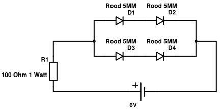
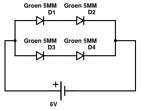

# how to create a lightsource product

description                       | amount
--------------------------------- | -------------
5mm bright LED red voltage 2v     | 4
5mm bright LED green voltage 3.2v | 4
5mm bright LED blue voltage 3.2v  | 4
plastic bulb matt 64mm diameter   | 3
solder print                      | 3
resistor 100 Ohm 1 Watt           | 1
solder tin                        | 
sandpaper                         | 

make the LEDs diffuse with the sandpaper

solder the leds according to the diagrams below.

Red

Green

Blue
