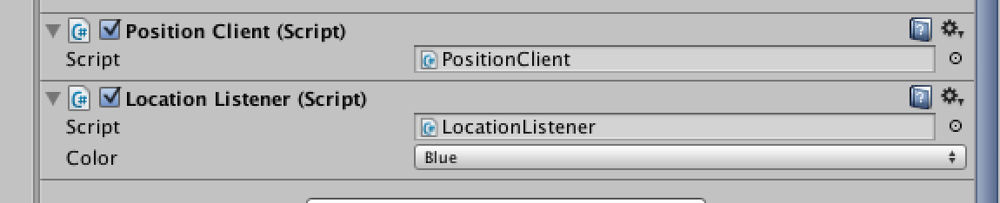

# Using positioning in Unity

The positioning for a Unity client consists of 3 components:

* A position client component receiving updates from the server
* A position listener component which subscribes to position updates from the position client and translates the entity to which it is attached
* An orientation component which rotates the entity to which it is attached based on the gyroscope

## Positioning

Attach the PositionClient and LocationListener components located in Frameworks to the entity. Select the desired color or change it at runtime.

## Orientation

Attach the GyroOrientation component located in frameworks to the entity.
